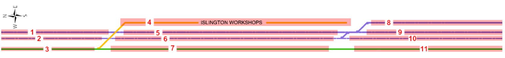
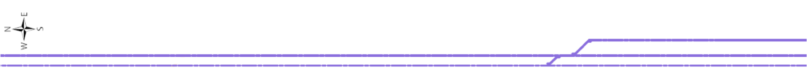
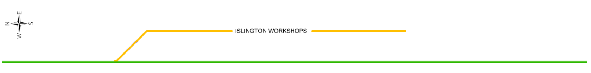
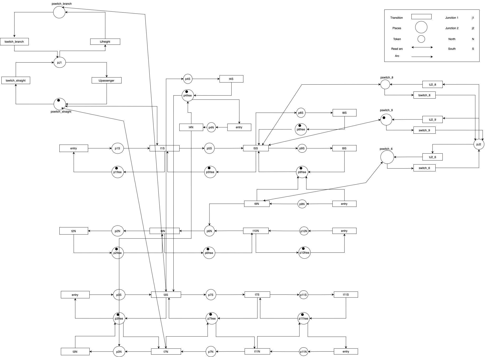

# PetriNet Modelling of a Rail Network
The network of interest is given as follows, which consists of 11 sections.

The network can be further divided into the passenger line: 

and the freight line connecting to the Islington Workshops:

The two lines are disconnected and trains cannot be move from passenger line to freight line and vice versa. 

# Train movements:
Trains can travel N-S (left - right)
- Entry: 1, 3.
- Exit: 4, 8, 9, 11.

Train can travel S-N (right - left)
- Entry: 4, 9, 10, 11
- Exit: 2, 3

Based on the project brief, the following paths are legal: 

North-South: 
- 1, 5, 8
- 1, 5, 9
- 3, 4
- 3, 7, 11

South-North: 
- 4, 3
- 9, 6, 2
- 10, 6, 2
- 11, 7, 3

# Network Segment Modelling and Description:
The modelling style for the Petrinet components is inspired by the style outlined in reference materials [1] and [3]. In building the network, we will first consider each section as a network of source and sink transitions [4] without any constraint, then gradually increase the level of complexity.  

## One way section:
One-way section allows trains to move in only one direction - i.e. either North to South or South to North. Some one way sections are (1, 2, 5, 6, 8, 10). For instance, a place-transition structure of section 2 is shown:  

Transitions are named based on the following structure: t<section_from><section_to>. For instance, $t_{62}$ indicates a transition from section 6 to section 2. Transitions that involve section 0 indicate entry/exit. For instance $t_{20}$ indicates the exit transition from section 2. A marking of a place $p_i$ is indicated as $m_i$ and is shown diagramatically as a dot.

## Two-way section:
Two-way section allows trains to move in both directions. Some two-way sections are (3, 4, 7, 9, 11). For instance, a place-transition structure of section 11 is given as follows:

Two-way sections contain two places, corresponding to N-S direction (L) and S-N direction (R). It is noted that some authors [3] use a simplified version of the above place-transition structure:

However, I decided to keep the un-simplified version to make explicit that trains that are moving N-S cannot abruptly turn around and move S-N and vice-versa. 

## Junction:
When two paths intersect, a constraint must be placed to prevent multiple trains in the same intersection which can cause accidents to occur. We shall use the point structure as described in [1] and [2] to control movements of trains in intersection. Consider the intersection between path <1,5> and path <3,4>:

A train passing the junction from section 1 to 5 is represented by the firing of transition $t_{15}$, which requires a marking at $p_{1L}$ (a train is currently present in section 1) and a marking at place $R_1$ of the point system (right path is available for passing). Similarly, passage from section 3 to section 4 requires markings at $p_{3L}$ and $L_1$. Initially, $R_1$ is marked to indicate passenger trains having higher passage priority than freight trains at junction. 

Marking can be changed from $L1$ to $R1$ via the transition $t_{L1j1}$ to place $j_1$ and then firing transition $t_{j1R1}$ to place $R1$, which now enables freight passage. Double direction arrows are used to indicate self-loop -i.e. after $t_15$ is fired, a marking is consumed and produced at $R_1$, leaving the total marking at $R_1$ unchanged.

## Entry and Exit: 

Entry from an external source - i.e. train station is represented with place $p_0$ and transition $t_{00}$ which is always enabled. Note that transition $t_{00}$ doesn't have any input place so it is a source [4] and can be fired spontaneously.

Marking of $p_0$ represents the presence of trains from an external source wishing to enter the network. Whether an external train is allowed to enter is subjected to the availability of the section to be entered. In the figure, place 1 is available should an external train wishes to enter the network. 

Exit is represented as a simple sink transition t<exit_section><0> and can also be fired spontaneously -i.e. trains at the exit points of the network can always exit without any requirements. 

# Full Petrinet

The full model is shown with initial markings indicating that all sections are initially empty.

Uni-directional sections only have one place (sections 1, 2, 5, 6, 8, 10); bidirectional sections have two places with $L$ and $R$ sub-indices to indicate the travel direction of trains on those sections (sections 4, 7, 9, 11). Section 3 has 3 places, with $U$ indicating presence of trains travelling from 3 to 4, $L$ from $3$ to $5$, and $R$ $5$ to $3$.

The two junctions are controlled using points $j_1$ and $j_2$. $j_2$ system contains three places, with $L_2$ enabling passage from $5$ to $8$, $R_2$ from section 9 to 6, and $M_2$ from 5 to 9 and 10 to 6 at the same time. Similarly, when $L_1$ is marked, passages from 3 to 4 or from 4 to 3 are allowed. When $R_1$ is marked, passages from $1$ to $5$ and $7$ to $3$ are allowed.  

# Summary

## Possible paths: 
- 1, 5, 8
- 1, 5, 9
- 3, 4
- 3, 7, 11 
- 4, 3
- 9, 6, 2
- 10, 6, 2
- 11, 7, 3

## Simple constraints: 
- At most one train can be present on any section at anytime. 

## Entry constraint:
- A train from 3 to 4 cannot enter if a train from 4 to 3 is present.
- A train from 4 to 3 cannot enter if a train from 3 to 4 is present. 
- A train from 11 to 3 cannot enter if there is a train from 3 to 11 or from 7 to 11 present. 
- A train from 3 to 11 cannot enter if there is a train from 7 to 3 or from 11 to 3 present. 
- A train from 9 to 2 cannot enter if a train from 1 to 9 is present. 
- A train from 1 to 9 cannot enter if a train from 9 to 2 is present. 

## Section priority: 
- Trains travelling from 1-5 and 6-2 have higher priority over trains from 4-3 or from 3-4.
- Trains travelling from 5-8 and 10-6 have higher priority over trains from 9-6.

# Reference 
[1] Banik, Mandira, and Sudeep Ghosh. "Railway network modelling using petri nets." International Journal of Science, Engineering and Computer Technology 3.7 (2013): 249.

[2] Giua, Alessandro, and Carla Seatzu. "Modeling and supervisory control of railway networks using Petri nets." IEEE Transactions on automation science and engineering 5.3 (2008): 431-445.

[3] Hagalisletto, Anders Moen, et al. "Constructing and refining large-scale railway models represented by Petri nets." IEEE Transactions on Systems, Man, and Cybernetics, Part C (Applications and Reviews) 37.4 (2007): 444-460.

[4] Murata, Tadao. "Petri nets: Properties, analysis and applications." Proceedings of the IEEE 77.4 (1989): 541-580.
